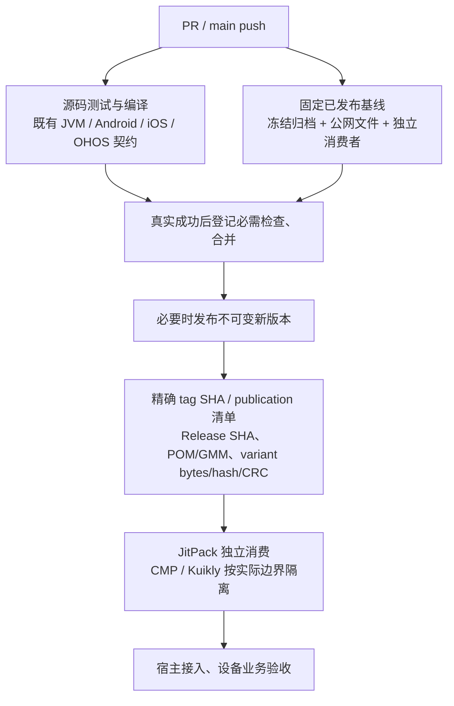

# 组件自动回归门禁

本轮为 14 个功能组件接入 GitHub Actions，Koin/Stately/MMKV 三个基础依赖不在此轮范围；工作流上线和必需状态登记以真实运行结果为准，不能用 YAML 存在、零检查或全 skipped 表示成功。

## 固定规则

- PR 回归候选源码，并消费明确的旧版本作为发布渠道基线；不能借此声称候选源码已经发布。新版本发布后必须再指定新版本消费。
- Gradle consumer 不用 mavenLocal、源码 includeBuild 或组件 project 替换。需要 CMP/Kuikly 的组件分别消费入口；无 UI 依赖的 diagnostics 使用同一框架无关公开 API，不人为添加 UI 依赖。
- Maven 归档先校验冻结 SHA，再复用 [`check-maven.py`](../templates/check-maven.py) 验证全部 publication、POM/许可证、GMM 文件/四种摘要和内部固定版本。
- [`check-public-maven.py`](../templates/check-public-maven.py) 另验实际 JitPack 标签 SHA、精确 publication 清单及公网文件。校验每个 variant 声明，不用下载去重掩盖不同变体声明的 hash 冲突。MD5/SHA1 公网 sidecar 必需匹配；SHA256/SHA512 的 HTTP404 记录缺失，不算通过。
- JitPack 会把 GMM component 正规化为组织/repo；只接受这一明确转换，POM、available-at、内部依赖仍按实际可消费 group/module/version 校验。归档 source group 和公网 group 有差异时分别填写，不放宽为任意身份。
- JVM 源码测试的运行 JDK 与历史发布字节码分别登记。明确消费目标的归档可用 `check-maven.py --max-jvm-major 61` 拒绝高于 Java 17 的 class；Java 21 对应 major 65。location `0.1.3`、system-actions `0.2.0-rc.4`、wechat `0.1.5`、jverification `0.1.3`、debug-tools `0.2.0-rc.3` 的已发布 JVM 文件实测为 major 65，当前远程消费门禁覆盖 Android/iOS/OHOS，不能据源码 Java 17 测试声明这些旧 JVM 包可在 Java 17 运行。diagnostics 新候选四模块显式固定目标 Java 17，旧 rc.5 基线 JVM 使用 Java 21。
- macOS 以实际 runner 架构选择 simulator，测试报告必须有实际执行的 test case，禁止把 disabled target 或全 skipped 当作回归。
- iOS/OHOS 的编译与最终链接分别记录；OHOS Kotlin 编译不等于 HAR 组装。ArkTS 契约按已有 Node 测试执行，缺少 DevEco/Hvigor runner 的组装与真机范围如实保留。
- 仓库保护保留现有 PR、管理员约束和禁止强推/删除规则。只有对应 source/consumer jobs 真实成功才加入必需状态；自动检查不能替代设备业务验收。

Actions 使用只读权限、固定完整 Action SHA，不运行生产短信、支付或通知。重构建 max-workers=1；本机跨会话构建仍串行。GitHub runner 的国内镜像失败由 CI-only 仓库策略处理，不改生产仓库解析；Eazytec DNS 失败保留具体运行和最终重跑结论。

## 本轮证据

共用模板的最小自检与 diagnostics `0.2.0-rc.5` 的实际公开文件校验已通过：14 publications、14 variant files；POM/GMM/variant 共 42 份响应的 MD5/SHA1 均与实际字节匹配。84 项 SHA256/SHA512 公网 sidecar 返回404，明确为缺失。

各组件真实源码/消费者运行和保护状态仍在推进，以对应 PR 的 Actions 结果为准；合并、发布和新版本消费完成后更新此处的交付记录。
