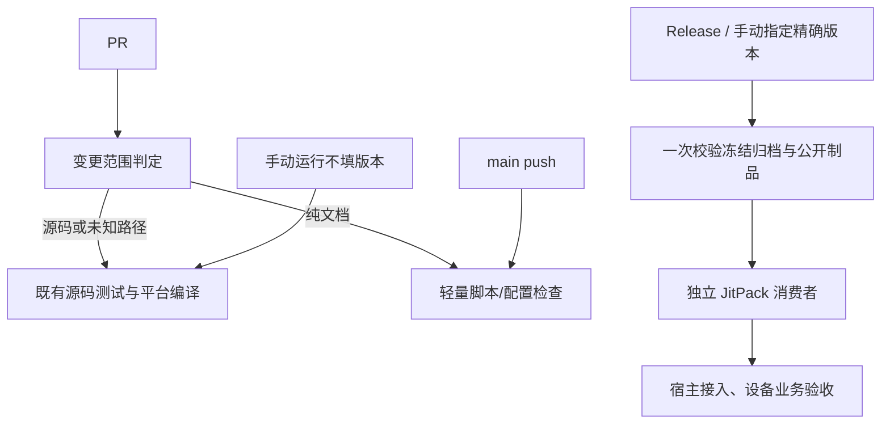

# 组件自动回归门禁

当前 CI 阶段、缓存、失败传播、版本合同与评审执行计划见[CI 优化与评审计划](CI优化与评审计划.md)。以下带日期/版本的内容保留当时事实，不作为当前 CI 已在线生效的证明；以对应提交的实际 Actions 结果为准。

当前方案覆盖 14 个功能组件；Koin/Stately/MMKV 三个基础依赖不在此 CI 范围。required job 的轻量完成或跳过不能算平台编译已执行。

## 固定规则

- PR 按变更范围回归候选源码，不再反复消费旧远程基线；新版本发布后独立指定精确版本消费。修复消费者自身时可手动指定已发布版本验证，不能借旧制品声称候选源码已发布。
- Gradle consumer 不用 mavenLocal、源码 includeBuild 或组件 project 替换。需要 CMP/Kuikly 的组件分别消费入口；无 UI 依赖的 diagnostics 使用同一框架无关公开 API，不人为添加 UI 依赖。
- Maven 归档先校验冻结 SHA，再复用 [`check-maven.py`](../templates/check-maven.py) 验证全部 publication、POM/许可证、GMM 文件/四种摘要和内部固定版本。
- [`check-public-maven.py`](../templates/check-public-maven.py) 另验实际 JitPack 标签 SHA、精确 publication 清单及公网文件。校验每个 variant 声明，不用下载去重掩盖不同变体声明的 hash 冲突。MD5/SHA1 公网 sidecar 必需匹配；SHA256/SHA512 的 HTTP404 记录缺失，不算通过。
- JitPack 会把 GMM component 正规化为组织/repo；只接受这一明确转换，POM、available-at、内部依赖仍按实际可消费 group/module/version 校验。归档 source group 和公网 group 有差异时分别填写，不放宽为任意身份。
- JVM/Android AAR 源码测试的运行 JDK 与历史发布字节码分别登记。明确消费目标的归档可用 `check-maven.py --max-jvm-major 61` 拒绝高于 Java 17 的 class，范围包含 JVM JAR 与 AAR 的 classes.jar/libs/*.jar；Java 21 对应 major 65。location `0.1.3`、system-actions `0.2.0-rc.4`、wechat `0.1.5`、jverification `0.1.3`、debug-tools `0.2.0-rc.3` 的已发布 JVM 文件实测为 major 65，当前远程消费门禁覆盖 Android/iOS/OHOS，不能据源码 Java 17 测试声明这些旧 JVM 包可在 Java 17 运行。diagnostics rc.6 四个 JVM JAR 固定目标 Java 17，Android AAR 曾随打包 JBR 21 生成 major 65；rc.7 四模块 JVM/Android 均显式固定 Java 17，旧 rc.5 基线 JVM 使用 Java 21。
- macOS 以实际 runner 架构选择 simulator，测试报告必须有实际执行的 test case，禁止把 disabled target 或全 skipped 当作回归。
- iOS/OHOS 的编译与最终链接分别记录；OHOS Kotlin 编译不等于 HAR 组装。ArkTS 契约按已有 Node 测试执行，缺少 DevEco/Hvigor runner 的组装与真机范围如实保留。
- 仓库保护保留现有 PR、管理员约束和禁止强推/删除规则。只有对应 source/consumer jobs 真实成功才加入必需状态；自动检查不能替代设备业务验收。

Actions 使用只读权限、固定完整 Action SHA，不运行生产短信、支付或通知。重构建 max-workers=1；本机跨会话构建仍串行。GitHub runner 的国内镜像失败由 CI-only 仓库策略处理，不改生产仓库解析；Eazytec DNS 失败保留具体运行和最终重跑结论。

DNS 预热是可观察的有限尝试，不是额外硬门禁：最后一次失败只记日志，让 Gradle 使用现有缓存并执行真实解析；实际缺失依赖或测试失败照常失败。diagnostics 定向验证强制注入三次 `UnknownHostException`，仍执行真实 Gradle `help`，7 秒成功。这只验证预热失败分支，不算组件测试或远程消费通过。media/scanner/permission 的独立 curl marker 探针也移除，避免在实际消费者尚未启动时由另一进程的解析失败提前退出。

## 历史门禁上线与发布证据

以下保留各版本当时的门禁与发布事实；旧事件矩阵和 job 数不作为当前候选规则。

共用模板的最小自检与 diagnostics `0.2.0-rc.5` 的实际公开文件校验已通过：14 publications、14 variant files；POM/GMM/variant 共 42 份响应的 MD5/SHA1 均与实际字节匹配。84 项 SHA256/SHA512 公网 sidecar 返回404，明确为缺失。

以下只登记最新候选 HEAD 的五项真实成功、必需检查登记及普通 PR 合并。main push 的三项源码检查与 PR 的五项源码/远程消费检查分别计算，不借旧运行补齐新 HEAD。

| 组件 | 已通过的候选 HEAD | 完整 PR 回归 | 合并到 main | 必需检查 |
| --- | --- | --- | --- | --- |
| sound | `acaf9f1275eb6904d7025b3615696b62b355676d` | [PR #11](https://github.com/gycrosskit/sound/pull/11)、[5 项成功](https://github.com/gycrosskit/sound/actions/runs/37301147046) | `63bd2336c1e892de28c191873cc3c0f0a845ec9a` | 5 项，strict，GitHub Actions app 15368 |
| permission | `b3280e3858ed67a13c05a8c563705562d287be60` | [PR #18](https://github.com/gycrosskit/permission/pull/18)、[5 项成功](https://github.com/gycrosskit/permission/actions/runs/37315366329) | `5087be3e4861dcc5a14b316f65c8dff30dcc4b90` | 5 项，strict，GitHub Actions app 15368 |
| scanner | `c41c4e4e088379443829f9f58cd19496e217a2b9` | [PR #15](https://github.com/gycrosskit/scanner/pull/15)、[5 项成功](https://github.com/gycrosskit/scanner/actions/runs/37315401375) | `6051f23ce301ad023ce0d042fec5d1f06ef97e88` | 5 项，strict，GitHub Actions app 15368 |
| media | `4e5e5f073cb3c3f55e3da43da782b43603d26138` | [PR #16](https://github.com/gycrosskit/media/pull/16)、[5 项成功，attempt 2](https://github.com/gycrosskit/media/actions/runs/37315402371) | `bf9e6a526a7329ada2e89ca8c3372f74cffdf4f9` | 5 项，strict，GitHub Actions app 15368 |
| system-actions | `ec977e5295e9553ca598bce2f37cc591ecb5849a` | [PR #23](https://github.com/gycrosskit/system-actions/pull/23)、[5 项成功，attempt 2](https://github.com/gycrosskit/system-actions/actions/runs/37315402700) | `9a54e845119bcee70da469c52fb147109e0676fd` | 5 项，strict，GitHub Actions app 15368 |
| toast | `baf91c378819e234a1a8b4f96013aceda54c757d` | [PR #14](https://github.com/gycrosskit/toast/pull/14)、[5 项成功](https://github.com/gycrosskit/toast/actions/runs/37315402309) | `4434e205cf83151bb22c5ac8b54a51304a2d1ede` | 5 项，strict，GitHub Actions app 15368 |
| wechat | `253f678eb93af523224d7c9ca1034dd917ee44f0` | [PR #18](https://github.com/gycrosskit/wechat/pull/18)、[源码](https://github.com/gycrosskit/wechat/actions/runs/37302460191)、[远程消费](https://github.com/gycrosskit/wechat/actions/runs/37302460126) | `3bfe09bf628a2a6bf0b7c29f68d29d0ca75495f0` | 5 项，strict，GitHub Actions app 15368 |
| jverification | `a08ff14e4f2be49dfd0410057083da34e36b5cb6` | [PR #11](https://github.com/gycrosskit/jverification/pull/11)、[源码](https://github.com/gycrosskit/jverification/actions/runs/37315518783)、[远程消费](https://github.com/gycrosskit/jverification/actions/runs/37315518972) | `84f9fcd411b9f9703afd500e91f4d28670d1fbd2` | 5 项，strict，GitHub Actions app 15368 |
| debug-tools | `deed4b6a74f89d8dc16a22b21a8dce9bda4fdebb` | [PR #13](https://github.com/gycrosskit/debug-tools/pull/13)、[源码](https://github.com/gycrosskit/debug-tools/actions/runs/37307104678)、[远程消费](https://github.com/gycrosskit/debug-tools/actions/runs/37307104618) | `d1a13d83b21b317e967154bd5e71a0ab93e15242` | 5 项，strict，GitHub Actions app 15368 |
| live-sdk | `7121481f62d781fbfc0c56ad01b6c602ca157ccb` | [CI PR #25](https://github.com/gycrosskit/live-sdk/pull/25)、[源码](https://github.com/gycrosskit/live-sdk/actions/runs/37565409095)、[远程消费基线](https://github.com/gycrosskit/live-sdk/actions/runs/37565409003) | `efeb94c71cf4a1471d0398c05340f258fc51b381` | 5 项，strict，GitHub Actions app 15368 |
| customer-service | `e4e04efead83f4a0e2e83c6b1fc17e1b8263ce7a` | [PR #11](https://github.com/gycrosskit/customer-service/pull/11)、[源码](https://github.com/gycrosskit/customer-service/actions/runs/37310403288)、[远程消费](https://github.com/gycrosskit/customer-service/actions/runs/37310403286) | `8fae758336a3d0a4b5dde80c51567c999a233c84` | 5 项，strict，GitHub Actions app 15368 |
| location | `f512ea8920051a26c2c901725fdfc2254d511f18` | [PR #11](https://github.com/gycrosskit/location/pull/11)、[5 项成功，attempt 2](https://github.com/gycrosskit/location/actions/runs/37315363309) | `fcda07c1dc6a9481e938d28b732041ed111d2d54` | 5 项，strict，GitHub Actions app 15368 |
| compose-webview | `3a5f6ad3394fdb09473655ef25b2e80e99db7ab9` | [PR #25](https://github.com/gycrosskit/compose-webview/pull/25)、[源码](https://github.com/gycrosskit/compose-webview/actions/runs/37559559834)、[远程消费基线](https://github.com/gycrosskit/compose-webview/actions/runs/37559559806) | `933f3682f79e1413584823ffd1854cb734f4cfb2` | 5 项，strict，GitHub Actions app 15368 |
| diagnostics | `358f6b4d091afb5c971701be47c6eb3bd3a0a001` | [PR #14](https://github.com/gycrosskit/diagnostics/pull/14)、[5 项成功](https://github.com/gycrosskit/diagnostics/actions/runs/37322960832) | `e0891d743e4b22f157bd1922f305ad21507a1570` | 5 项，strict，GitHub Actions app 15368 |

首次门禁上线时除 diagnostics 外，其余组件只更新 CI、校验及消费者。之后 live-sdk 另发布 rc.8 修复 FRAME、rc.9 修复 STARTED 宿主的快照漏订阅，见文末。原生工具链下载、DNS 或连接超时均保留失败运行，修复后以相同规则重新验证；不把基础设施故障算成源码通过。

diagnostics 新功能源码在上述 CI 实际执行 138 次测试（JVM/Android 101、iOS simulator 37），Swift typecheck 通过；旧 rc.5 的独立消费完成 JVM/Android 与 iOS Framework/OHOS `.so` 链接。[rc.6 Release](https://github.com/gycrosskit/diagnostics/releases/tag/0.2.0-rc.6) 已发布，24 publications 的冻结归档 SHA-256 为 `463a7761f690037699e9be6c98bb83f3eec2c7bca9945ecd896989f155520ad2`。JitPack 标签精确指向 `81c6444d853ad1fd23ed9d870094ed9358f7e11b`，24 publications/24 variant files 公网校验已通过；POM/GMM/variant 共 72 份响应的 MD5/SHA1 全部匹配，144 项 SHA256/SHA512 sidecar 返回404、记为缺失；四个 JVM 包实测 major 61。

rc.6 本机独立消费者明确指定 `diagnosticsMavenRepo=https://jitpack.io`，刷新解析，不使用源码/本地 Maven 替换；JBR 21 上 JVM 1 次、Android 2 次测试及 iOS arm 编译、simulator Framework/OHOS `.so` 最终链接通过（2m22、26 tasks：17 executed/9 up-to-date）。但这不能证明 Java 17 Android 消费：四个 AAR 的 classes.jar 实测为 major 65。

[rc.6 Release 运行 37317554975](https://github.com/gycrosskit/diagnostics/actions/runs/37317554975) 首轮 Android 消费在 JitPack 尚未就绪时退出，测试未启动；源码 Native 在 KGP marker 解析退出，底层 HTTP 原因未明。唯一同 HEAD 重跑后，源码 Native 37 次 simulator 测试真实通过（7m44、24 tasks 全 executed）；Java 17 JVM 消费通过，但 Android 两项 `BoundedReportWriter` 消费测试因 `UnsupportedClassVersionError`（major 65 > 61）真实失败，未追加概率重跑。Java 17 远程 Native 首轮已通过：iOS arm 编译、simulator Framework/OHOS `.so` 链接完成，10m27、7 tasks 全 executed。rc.6 标签、附件与失败记录保持不可变，Release Notes 已补明 Android 兼容缺口。

修复 [rc.7 / PR #14](https://github.com/gycrosskit/diagnostics/pull/14) 显式固定四个 Android Kotlin/Java 编译目标为 17，checker 同时验证 AAR 内 classes.jar/libs/*.jar 的 class-major 和 ZIP CRC。新增 fixture 覆盖 AAR 61/65、嵌入库 61/65、内层 CRC 损坏及无上限历史模式，17 个 fixture 分支通过。[rc.7 Release](https://github.com/gycrosskit/diagnostics/releases/tag/0.2.0-rc.7) 已发布，24 publication 归档 SHA-256 `6bfc9636d119564f176f684fe0e7e4b76edd21bbc60d6cb2eebe7c5782522468`；四 JVM JAR 与四 AAR 逐类均为 major 61。实际 JitPack 24 publications/24 variants 公网校验通过，72 份 POM/GMM/variant 响应的 MD5/SHA1 匹配，144 项 SHA256/SHA512 sidecar 404 明确缺失；八个运行时 JAR/AAR 的实际公开字节与冻结归档逐文件一致、major 61。新建独立消费目录以 JitPack 解析 rc.7，JBR 21 上 JVM 1 次/Android 2 次测试、iOS arm 编译、simulator Framework/OHOS `.so` 链接实际完成，2m12、26 tasks 全 executed；[GitHub Release 运行 37325537590](https://github.com/gycrosskit/diagnostics/actions/runs/37325537590) 最终五项全部成功：Java 17 下新版本 JVM 1 次/Android 2 次公开消费测试实际通过（2m20、20 tasks 全 executed），iOS arm 编译、simulator Framework/OHOS `.so` 最终链接实际通过（9m11、7 tasks 全 executed）。该次发布时宿主可选网络适配尚未接线；当时宿主会话保留原文日志策略。2026-10-07 的候选接线与验证另见文末，设备业务验收仍由用户完成。

rc.6 历史宿主验收：当时已完成现有 core/dingtalk 的 rc.6 升级，dependencyInsight 核对四份 core/dingtalk root/Android 坐标均为 rc.6；诊断、通知、上传与导出 44 次 Mock 定向测试通过（零失败/零跳过）。CMP iOS simulator、Kuikly iOS arm/OHOS 源码编译和 Chonghe Kuikly Debug APK/D8 通过（50 秒、108 tasks：35 executed/73 up-to-date）。宿主未接新采集器，保留日志策略、Git Pod rc.1；未做 Xcode/HAP 重包或设备验收，未提交/推送，此结果不替代组件 GitHub Java 17 消费检查。

debug-tools 的源码原生检查执行了其余测试，但两项既有 Keychain 用例在 runner 中跳过：跨 store 的 token identity、损坏 token 的凭据清理。它们不计入已通过测试；完整 Keychain 行为仍需要具备相应权限的宿主/设备验收。OHOS Kotlin 编译也不等于 HAR/设备验收。

location 的已发布 `0.1.3` KLIB 需要 Xcode 26 SDK 才能最终链接，远程消费者门禁选择 runner 已安装的 Xcode 26.0.1/iOS 26.0；项目 iOS 14 deployment 保持不变。源码 iOS 模拟器实际执行 3 次测试，远程 Framework/OHOS 链接通过。

compose-webview 的 Kuikly iOS 测试源集没有用例，任务为 NO-SOURCE/SKIPPED，不算单测通过；其真实验证是 API 编译及独立消费者编译，CMP/core 的模拟器测试另有实际执行报告，CMP Framework 已实际链接；Kuikly Native 检查只证明 API 编译，不覆盖完整 Render/Swift SDK 最终链接。customer-service 没有 OHOS KLIB/JVM publication，不登记不存在的编译/消费目标；它的 Native 门禁覆盖实际 iOS 入口。

本批上线时，为释放 macOS 队列，先比对已合并提交与五项检查成功的 PR HEAD 的 Git tree，再取消仍排队且没有运行中 job 的重复 main 源码检查。以下运行的结果是 cancelled，不是 main 检查成功；后续 main 自动触发保持启用。

| 组件 | main 运行 | 与已验证 PR 相同的 tree | 本次结果 |
| --- | --- | --- | --- |
| scanner | [37311098268](https://github.com/gycrosskit/scanner/actions/runs/37311098268) | `718beb34631c55f4af0edc315c805b833fa0d182` | cancelled |
| scanner | [37318822935](https://github.com/gycrosskit/scanner/actions/runs/37318822935) | `4ffe6f3a5d603e3e269178cd695d3770e27ba611` | cancelled |
| toast | [37311918388](https://github.com/gycrosskit/toast/actions/runs/37311918388) | `59c9315cbfd82bbf484be53d66d0c4ba1dadb70a` | cancelled |
| toast | [37319869274](https://github.com/gycrosskit/toast/actions/runs/37319869274) | `c1fae0bb460a8c84ef7506144d04889ee1029859` | cancelled |
| debug-tools | [37311833968](https://github.com/gycrosskit/debug-tools/actions/runs/37311833968) | `4448574935f15b9796c298f1282d03f443e4b0b0` | cancelled |
| customer-service | [37313804351](https://github.com/gycrosskit/customer-service/actions/runs/37313804351) | `a3bf5ee26dee238435611b73d75ff75de7abe318` | cancelled |
| system-actions | [37313887214](https://github.com/gycrosskit/system-actions/actions/runs/37313887214) | `4e28aad1915bfcfe52fb60dc0d553b9a74f6674c` | cancelled |
| location | [37319397913](https://github.com/gycrosskit/location/actions/runs/37319397913) | `1f8bec42567baa34a093b25248c8f8fc0e57a134` | cancelled |
| compose-webview | `3a5f6ad3394fdb09473655ef25b2e80e99db7ab9` | [PR #25](https://github.com/gycrosskit/compose-webview/pull/25)、[源码](https://github.com/gycrosskit/compose-webview/actions/runs/37559559834)、[远程消费基线](https://github.com/gycrosskit/compose-webview/actions/runs/37559559806) | `933f3682f79e1413584823ffd1854cb734f4cfb2` | 5 项，strict，GitHub Actions app 15368 |
| diagnostics | [37317367615](https://github.com/gycrosskit/diagnostics/actions/runs/37317367615) | `abb690c71c925764399d875a9390b7e7b70fde1f` | cancelled；Android 的 coroutines-slf4j POM TCP 超时另保留失败 |

sound [main 运行 37306714259](https://github.com/gycrosskit/sound/actions/runs/37306714259) 和 live-sdk [main 运行 37304007902](https://github.com/gycrosskit/live-sdk/actions/runs/37304007902) 的三项源码检查另有真实成功结果；push 事件不执行两项发布消费检查，它们仍由 PR/Release/指定版本手动运行负责。

media 新 main [37319085707](https://github.com/gycrosskit/media/actions/runs/37319085707) 的 Native 源码检查实际成功，Android core 测试通过后，独立 Kuikly Gradle 进程在 KGP marker 解析失败（消费测试未启动，底层 HTTP 原因未明）。该运行是 failure，不与最新 PR 五项真实成功混为一谈，也没有再追加概率重跑。

system-actions 最新 main `9a54e845119bcee70da469c52fb147109e0676fd` 的 [37322218458](https://github.com/gycrosskit/system-actions/actions/runs/37322218458) 三项源码检查实际成功；两项远程消费者仍按 push 事件规则跳过，不计入远程验收。

permission 最新 main `5087be3e4861dcc5a14b316f65c8dff30dcc4b90` 的 [37321892610](https://github.com/gycrosskit/permission/actions/runs/37321892610) 第二轮三项源码检查实际成功。首轮 Android core 测试通过，独立 Kuikly Gradle 在 KGP 实现 POM HEAD 请求时 TCP 超时、测试未启动；只重跑该失败 Android job 一次，随后真实消费者测试通过，保留两轮结果。两项远程检查按 main 规则跳过，PR 五项另有真实成功证据。

rc.7 发布第一次构建由 root 在 Release 草稿尚未公开时提前请求 POM 引起，JitPack 构建没有产物、退出22；Release消费者在冻结归档校验通过后遇到该缓存 POM404，测试/链接尚未开始。公开归档后使用已有登录仅清理该失败记录，按相同标签 SHA/相同归档重新构建，JitPack 已成功返回精确 main SHA和24模块；保留原始失败，不覆盖GitHub标签/附件。新 Release [37325537590](https://github.com/gycrosskit/diagnostics/actions/runs/37325537590) 三项源码先全部真实成功，再只对两个失败消费者 job 重跑一次；第二轮两个消费者均实际成功，整体运行最终为 success。[JitPack 官方重建说明](https://docs.jitpack.io/building/#rebuilding)允许清理失败构建后重新请求；此处没有删除已成功的远程产物。后续校验使用公开 API 和实际文件。

diagnostics rc.7 发布时 main `e0891d743e4b22f157bd1922f305ad21507a1570` 的 [37325286703](https://github.com/gycrosskit/diagnostics/actions/runs/37325286703) 三项源码检查实际成功；两项发布消费按 main 规则跳过。

宿主随后仅升级 core/dingtalk 至 rc.7 并更新唯一接入文档，dependencyInsight 四份 root/Android 坐标均为 rc.7，core-android 63 类/dingtalk-android 9 类实际字节码 major 61。44 次 Mock 测试本次实际执行、零失败/零跳过，Chonghe Kuikly Debug APK/D8实际通过（17秒、108 tasks：13 executed/95 up-to-date）。CMP iOS simulator 与 Kuikly iOS arm/OHOS 源码任务输入检查通过并复用 up-to-date 缓存，未重新编译/Native链接/Xcode/HAP；原日志策略、Pod rc.1保留，未接新采集器、未提交/推送，不算Java17 GitHub消费或设备验收。

jverification 最新 main `84f9fcd411b9f9703afd500e91f4d28670d1fbd2` 的 [37321661830](https://github.com/gycrosskit/jverification/actions/runs/37321661830) 最终为 success，三项源码检查通过；push 事件的两项发布消费不计入成功。

live-sdk [rc.8](https://github.com/gycrosskit/live-sdk/releases/tag/0.2.1-rc.8) 的 Android Kuikly View 将通用属性委托 Render 默认实现，不再丢弃 FRAME。真实布局契约从初始 0×0 下发首次/更新 FRAME，检查容器、TextureView 子视图与透明度；旧源码和公开 rc.7 AAR 均真实失败，修复后的源码及公开 rc.8 AAR 实际通过。PR 仍消费旧 rc.7 渠道基线，新版本另由 [Release 37447746047](https://github.com/gycrosskit/live-sdk/actions/runs/37447746047) 验证，不能混算。

rc.8 冻结归档含 15 publications，SHA-256 `dafc4a418eb100199bedbf8d4f1a77a44210483cb73f5324f8afc922511ca42e`；上传资产 digest/size 与冻结字节一致。JitPack 标签精确为 main `0239fdfc813884a45f8e68d7e9be3119858eecca`，公开 Kuikly Android AAR 与冻结产物逐字节一致，三个归档 AAR 为 major 55。Release 的公网检查实际验证 15 publications/15 variants、POM/GMM/variant MD5/SHA1；90 项 SHA256/SHA512 sidecar 返回404，记为缺失。本机另一次公网检查在 GMM 请求读取阶段 socket timeout，保留失败，不计为成功。

Java 17 下新版本 Kuikly APK、无 Compose/单 SDK 检查通过（1m55、37 tasks 全 executed）；真实公开 FRAME 测试通过（28秒、23 tasks：7 executed/16 up-to-date）；CMP APK、无 Kuikly/单 SDK 检查通过（1m15、37 tasks：20 executed/17 up-to-date）。公开 Native 消费者实际完成 Kuikly iOS arm/simulator/x64 API 编译（2m41、5 tasks 全 executed），CMP simulator Framework 最终链接及 arm/x64 编译（3m3、6 tasks：5 executed/1 up-to-date）；不算完整 Kuikly Render/Swift SDK 最终链接。Release 首轮两项均 success，main [37447658341](https://github.com/gycrosskit/live-sdk/actions/runs/37447658341) 三项源码检查也实际成功。iOS 原生源码未修改，Pod 保持已验 rc.7；此轮不声明新的 Swift ABI、鸿蒙直播或设备画面验收。

## Android Kuikly 快照订阅发布

live-sdk [rc.9](https://github.com/gycrosskit/live-sdk/releases/tag/0.2.1-rc.9) 在 Lifecycle.addObserver 同步补发 STARTED 事件之前初始化 scope，修复视频可播放但 loading、主播资料与人数停在默认值的竞态。真实 attach/Lifecycle/StateFlow 回归在旧源码和公开 rc.8 AAR 均因首次快照缺失失败，新源码通过，且覆盖后续更新、detach/reattach 与不重复订阅。只替换厂商会话边界，人工 joinSucceeded 不算真实 SDK 业务验收。

PR23 精确 HEAD 五项实际成功后普通合并，保留 strict/GitHub Actions app15368/管理员保护。冻结归档 SHA256 `01b915ae12df32063ee969a5a2f3567f9667b60d8c7e180b24a8d8d91d7874bd`，15 publications、三个 AAR major55、归档源码和上传 digest/size 均已核验；不可变标签解引用为 `e43a9afd2f973272d4d99b2792cb1269b7d83966`。新公开产物由 [Release37453428628](https://github.com/gycrosskit/live-sdk/actions/runs/37453428628) 实际验证，历史 rc.7 的 PR 远程基线不能算新产物消费。iOS 初始化无 Android 同源竞态，Pod/Swift View 保持 rc.7，不声明新的原生 ABI 或设备快照已验收。

rc.9 Release attempt1 两项实际 success，公开15 publications/15 variant文件及 POM/module/variant MD5/SHA1 通过；90项 SHA256/SHA512 sidecar HTTP404 仍记缺失，不计通过。公开 Kuikly AAR 与冻结字节一致，SHA256 `c2d0c509b433ebe33bd69a80f315f53eecffc2f8e4e9c7e4f0cbeaadd1b19132`。Java17 Kuikly APK/无Compose/单SDK、公开 FRAME+STARTED快照契约、CMP APK/无Kuikly/单SDK均通过。Native 为 Kuikly iOS arm/simulator/x64 API 编译与 CMP simulator Framework 链接及 arm/x64 编译；不算完整 Kuikly Render/Swift SDK 链接。main [37453296477](https://github.com/gycrosskit/live-sdk/actions/runs/37453296477) 三项源码检查也实际 success。设备与真实业务仍由宿主验收。

## 鸿蒙 WebView 数据清理发布

[rc.10](https://github.com/gycrosskit/compose-webview/releases/tag/0.2.0-rc.10) 为现有 HAR 导出 `OhosWebViewDataCleaner`：缓存清理保留 Cookie/存储，网站数据清理依次调用缓存、等待 Cookie、删除 WebStorage；系统失败原样传播，宿主保留调用时机、账号与取消回调策略。无新的 Module 或仓库，Git Pod 保持 rc.9。

PR25 精确 HEAD 五项实际成功后普通合并，合并树与冻结提交一致。不可变标签解引用为 `933f3682f79e1413584823ffd1854cb734f4cfb2`，Maven 冻结归档 SHA256 `9e7f9bf8015c949ef55a0458d7398d437b47bd0def7ce70c5c4300f8e2e5d0e0`，公开 HAR SHA256 `1115d09a03dc11caf091f15e6150d8a1e70a7ce9a64d2075a7f39699a07a23a7`。17 publications/17 unique variant files 与 POM/GMM/variant MD5/SHA1 通过；102 项 SHA256/SHA512 sidecar 返回404，仍记缺失。

全新 JitPack Kuikly 消费者 Android APK、无 Compose/精确版本检查、iOS 三架构 API 编译及 OHOS sharedlib 最终链接实际通过（41 tasks）；CMP 新目录公开消费另完成 Android APK、无 Kuikly/精确版本检查、iOS 三架构 API 编译及 simulator Framework 最终链接（42 tasks）。公开 HAR 在新目录消费（30 tasks）及真实 HAR 清理契约通过。OHPM 已提交 rc.10 审核，精确版本查询仍 NOTFOUND，不能写成 Registry 已可安装；其安装器不接受 manifest HTTPS HAR URL。审核期使用公开 Release HAR 下载及 SHA 校验后验证，正式依赖声明不写本机路径。设备清理与完整 Kuikly Render/Swift SDK 链接另行验收。

rc.10 Release [37560932635](https://github.com/gycrosskit/compose-webview/actions/runs/37560932635) 首轮两个消费者在归档校验通过后，公网检查遇到 JitPack 尚为 none/isTag=false，未进入编译或测试；JitPack 随后在同标签/归档上完成构建。保留首次失败，公开成功后只重跑失败 job，不把等待渠道构建算成消费成功。attempt2 两项实际成功，最终运行 completed/success。

## 兼容表情协议发布

[live-sdk rc.10](https://github.com/gycrosskit/live-sdk/releases/tag/0.2.1-rc.10) 的 `LiveEmojiProtocol` 与 `LiveEmojiValue` 保留旧宿主 62 项 display/token 映射、顺序、组合表情优先及未知标记透传。表情资源、选择、RichText 和删除最后输入仍留宿主。仅 `live-core` 增加 OHOS 中立 KLIB，Kotlin/Compose compiler 采用现有可支持 OHOS 的 `2.2.21-1.0.0`；根直播入口和 `live-kuikly` 仍为 Android/iOS，Git Pod 保持 rc.7，不宣称 OHOS 直播、IM 原生运行时或 PiP。

PR24 精确 HEAD 五项成功后普通合并，不可变标签解引用为 `3059cc6cecc0216940ffad7b3ee162ac31510ebe`，冻结 Maven 归档 SHA256 `9a4104362d7daab496a156ae532796dae95ddd2a051668707489ff9c7548b7b3`；重新下载的 Release 字节及上传 digest 一致，JitPack 为公开成功标签并返回精确 16 modules。本机 fork 工具链下 Android core 47、iOS core 43、Android Kuikly 5 项测试实际通过，覆盖全部 62 项协议、组合/未知输入与已有生命周期行为。

旧 rc.7 远程消费基线 [37559821829](https://github.com/gycrosskit/live-sdk/actions/runs/37559821829) 首次 Android job 在 fork KMP plugin marker 解析失败，未启动消费者。独立冷缓存、同 CI 仓库/Java security 配置解析通过，过滤正则实测正确；日志没有底层 HTTP 原因，未据此改配置或声称已明确归因。完整运行结束后仅重跑失败 job 一次，同 HEAD/归档完成 Kuikly 与 CMP Android 实际消费，attempt2 最终 success；原生消费首轮实际通过。新 rc.10 公开产物另由 [Release37561591959](https://github.com/gycrosskit/live-sdk/actions/runs/37561591959) 验证，不借旧基线结果替代。

rc.10 公网校验实际通过 16 publications/16 variants 的声明摘要、CRC 和 MD5/SHA1 sidecar；96 项 SHA256/SHA512 sidecar 返回404，仍记缺失。Release37561591959 attempt1 Android 在公开 AAR 回归任务解析 `kotlin-test-junit:2.2.21-1.0.0` POM 时遇到 Eazytec `UnknownHostException`，测试与 CMP 步骤未开始；Native 在 metadata sidecar 读取遇到30秒 TimeoutError，未开始消费者，异常未包含精确 URL，不能补写推断地址。保留两份原始失败日志，同标签/字节只重跑失败 job 一次，原运行最终仍为 failure。

Release attempt2 Native 实际通过 Kuikly iOS 三架构 API、CMP simulator Framework/三架构 API 和 OHOS core 编译；Android 再次在 fork KMP plugin marker 解析失败，日志仍没有底层 HTTP/DNS 原因。停止普通重试；已发布标签与归档不修改，也不把本机消费成功写成失败 job 成功。

rc.10 本机独占公开 JitPack 消费完整通过：Kuikly Android APK/D8、无 Compose/单 SDK、iOS 三架构 API 编译和新表情 API（3m7），真实公开 AAR 的 FRAME 与 STARTED 契约各1项测试、零失败/零跳过；CMP Android APK/D8、无 Kuikly/单 SDK、iOS 三架构 API 编译及 simulator Framework 最终链接（5m13）；OHOS core 新 API 编译实际执行3 tasks（1m33）。OHOS core 不含平台 driver，本轮没有增加组件最终 .so 链接 harness；宿主的新 .so/HAP 单独验证。上述本机通过不能替代失败的 GitHub Release Android job，后续 CI 修复和新 main 的指定版本消费另列。

## Live CI 依赖解析跟进

冷缓存诊断 [37562692386](https://github.com/gycrosskit/live-sdk/actions/runs/37562692386) 和实际 Kuikly→CMP Android 序列 [37563968869](https://github.com/gycrosskit/live-sdk/actions/runs/37563968869) 均完成；marker 及实现确实存在，过滤正则正确，未复现此前没有底层 HTTP 原因的 marker 失败。另一次候选 [37564852237](https://github.com/gycrosskit/live-sdk/actions/runs/37564852237) Native 明确在 curl/JVM 连续 DNS 失败后退出，不能以 DNS 预热成功推断其他进程也能解析。

[CI PR #25](https://github.com/gycrosskit/live-sdk/pull/25) 仅修改七个 CI/验证文件：临时 GitHub-hosted runner 复用本 job 经原域名 HTTPS 验证的公网 IPv4；仅系统解析失败后查询一次 Cloudflare DoH，并再次核对原域名 TLS、HTTP200 和地址一致。HTTP/TLS/产物错误不走备用解析，探测或 hosts 写入失败继续真实 Gradle。14 项可运行替身检查覆盖边界，不写本机 hosts。最终 HEAD `7121481f62d781fbfc0c56ad01b6c602ca157ccb` 五项真实成功后普通合并为 `efeb94c71cf4a1471d0398c05340f258fc51b381`，保留 strict/app15368/管理员保护；四个构建 job 均记录正常系统 DNS→HTTPS 地址复用，DoH 分支仅经替身验证，未据此声称公网备用已执行。生产源码、版本、冻结归档和 rc.10 标签保持原字节。

新 main `efeb94c71cf4a1471d0398c05340f258fc51b381` 显式指定公开 `0.2.1-rc.10` 的[完整消费者 37566448906](https://github.com/gycrosskit/live-sdk/actions/runs/37566448906) 已 completed/success，两项正式 job 均 success。Android 完成 Kuikly APK/D8/无 Compose/单 SDK、新表情 API、真实 AAR FRAME/STARTED 回归及 CMP APK/无 Kuikly/单 SDK；Native 完成 Kuikly iOS 三架构 API、CMP simulator Framework 最终链接/三架构 API，以及 OHOS core 新表情 API 编译（3 tasks 实际执行）。两 job 的 16 publications/variants 公网校验通过，96 项 SHA256/SHA512 sidecar 404 仍记缺失；原生播放与设备范围不变。[同 main 的源码运行 37566442137](https://github.com/gycrosskit/live-sdk/actions/runs/37566442137) 三项也 completed/success。PR 中旧 rc.7 基线通过不替代此新版本验收，原 Release37561591959 的 failure 记录保留。

## 四项宿主接线验证（2026-10-07）

首份独占宿主 Worktree 候选已完成 WebView 数据清理、远程表情协议、system-actions 复制/文件分享和 diagnostics-ktor 网络采集接线。复用现有组件，不新增仓库；Debug/QA 使用关联、有界、脱敏采集，Release 保留 INFO 策略，业务 UserSig、私有文件准入和取消/销毁仍由宿主负责。

实际公网消费的 23 个二进制已核对摘要，WebView 及 Live 字节另与冻结 Release 逐文件比对。33 项 XML 定向测试零失败/零跳过；两个充和 Debug APK、CMP/Kuikly iOS simulator API/Framework、新 OHOS shared.so 和未签名 HAP 通过。HAP 的新 so 经 BuildID 与全部 24 个 SHF_ALLOC section 校验，143 项包内资源检查通过。该证明不包括 Xcode 完整 App、真实网络业务或设备验收。

宿主负责会话已整合 WebView 清理、表情协议和复制/文件分享三项，并在最终远程依赖下通过妙手、康民 Android Debug APK、iOS 未签名完整 App、OHOS so/HAP、46 项定向测试和充和/慈航 CMP/Kuikly 编译回归。网络采集候选补丁已验证并交付，但宿主因使用方既有“不处理”日志策略暂未接入，不能写成四项全部整合。最终宿主状态以其唯一组件接入文档为准。

## 可配置网络日志策略（2026-10-07）

[diagnostics PR #15](https://github.com/gycrosskit/diagnostics/pull/15) 复用 `NetworkCapture` 已有 Body 开关、1..32 KiB 完整 UTF-8 额度及正文/URL 回调，只补可选 `redactHeader`。未传入时保持现有白名单和凭据遮盖；传入时由使用方选择原文、脱敏或拒绝。Header 回调返回 null/抛异常只遮盖该值，Body 回调返回 null/抛异常省略整段，不改业务 HTTP 数据。原九参数位置调用、命名调用和 trailing onLog lambda 的源码兼容已测试。

本机定向源码测试实际执行 100 项（core JVM 34、Android 29、iOS simulator 21，Ktor JVM 11、OkHttp JVM 5）；本机 JBR 21 运行不等同 Java 17 消费。宿主候选提供 `AppNetworkLogPolicy.Raw` 和 `Redacted`，可通过构造参数或 Koin 可选绑定覆盖：前者延续 Debug/QA 原文选择并设 32 KiB，后者为可选 4 KiB 凭据脱敏。Release 保持 INFO/no Body，日志上传仍排除，复用唯一 Client 和日志环。以下分别记录发布、新版本公开消费与宿主策略验收。

精确 HEAD `3ae0a594e542b43f746e828cd243719eb507933f` 的[五项 PR 门禁 37569105860](https://github.com/gycrosskit/diagnostics/actions/runs/37569105860) 全部 completed/success，再普通合并至 `ca02f12004d503ff25a1f85d62388c220d703d91`；源码、发布配置与候选相同。PR 的 Java 17 源码 JVM/Android 实际运行 107 项、iOS simulator 40 项，共 147 项测试通过；历史 rc.5 的公开消费仍使用 Java 21，不能混作新版本验收。[rc.8 Release](https://github.com/gycrosskit/diagnostics/releases/tag/0.2.0-rc.8) 已公开，24 publication 归档 SHA-256 为 `9f4c2b56b7ba965067d7a8d3f298bf62fb3bffb224ca909eb057b61f478d2fa6`；全部生产源码与 sources JAR 逐字节匹配，四个 JVM JAR 与四个 AAR 固定 major 61。Swift Package/Git Pod 保持 rc.1，无 HAR。

JitPack 实际状态为 ok/isTag/public，精确指向 main `ca02f12004d503ff25a1f85d62388c220d703d91`，24 publications/24 unique variant 文件全部公开校验通过：字节数、声明的四种摘要、ZIP CRC、available-at 身份与内部版本匹配。POM/GMM/variant 的 MD5/SHA1 公网 sidecar 通过；144 项 SHA256/SHA512 sidecar 返回404，仍明确记为渠道缺失。公开文件校验不替代新 API 的消费者构建。

新目录的独立消费者使用 `https://jitpack.io` exclusive 仓库与 `--refresh-dependencies`，无 staging、mavenLocal 或源码替换；实际下载 rc.8 POM/GMM/AAR/JAR/KLIB。JBR 21 下 JVM 1 项、Android 2 项测试通过，新 Header 策略消费源码在 JVM/Android 以及 iOS arm64 编译，simulator Framework/OHOS `.so` 最终链接完成（1m40、26 tasks 全 executed）。这不替代 GitHub Java 17 新版本消费和宿主策略验收。

宿主网络专用候选用实际远程 rc.8 完成 26 项定向测试（网络策略 9、日志环 7、SessionAuthorization 6、真实 Koin 4），Android 生产/测试源码编译、iOS simulator/OHOS 编译通过。仅 10 个网络文件，基于宿主负责会话当时工作文件的补丁通过只读 `git apply --check`，已交付其实际接入；不重放已整合三项能力或改动 SDK/直播。初次 SDK 环境未指定发生在任务配置阶段，随后显式使用既有 SDK；新增 Koin 夹具硬编码旧短信路由导致隐私准入拒绝，已改为唯一 `ApiRoutes.APP_SEND_SMS` 常量并同范围复验。两次失败与最终通过分别留证，不记为生产策略缺陷。

新 rc.8 的[Release 37570392010](https://github.com/gycrosskit/diagnostics/actions/runs/37570392010) 最终 completed/success，contracts、android、native、release-android、release-native 五项全部实际成功。新版本 Java 17 JVM/Android 消费与 iOS arm 编译、simulator Framework/OHOS `.so` 最终链接通过，包含新的 Header 策略 API；PR 的旧 rc.5 基线不替代该结果。宿主负责会话已收到可配置策略接入任务，实际整合状态以其唯一组件接入文档为准；设备业务验收由用户完成。
