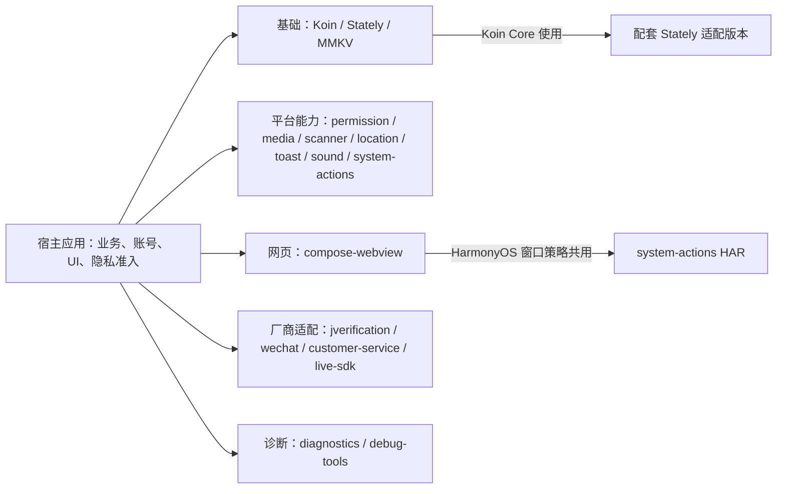
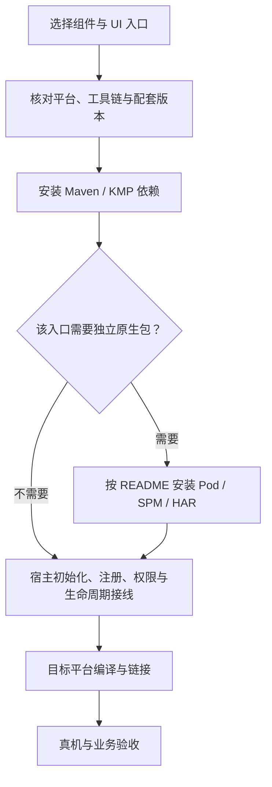

# GY CrossKit

面向 Kotlin Multiplatform、Compose Multiplatform（CMP）与 Kuikly 应用的跨平台组件。按用途选择仓库，再阅读对应 README 完成安装和平台接线。

本轮版本核对日期：**2026-10-05**。新版本的发布、实际文件校验与新建消费工程分别记录；本轮变更的真实远程消费已通过，具体范围以各库验收文档为准。OHPM 审核中时使用同标签 Release HAR，不能写成 Registry 已上架。Maven 由 JitPack 提供；iOS 原生接线与 HarmonyOS HAR 独立安装，版本可能不同。预发布状态以 Release 标记为准，包含没有 `rc` 后缀的工程候选；编译和链接通过仍需接入项目完成设备验收。

## 组件地图与接入流程

下图按用途分组，不表示组内组件互相依赖；各库独立安装，按业务需要选择。具体内部结构、公共类型和生命周期见各仓库 README 的“架构与调用流程”。

Maven 和原生包可能使用不同版本；HAR 的 Release 下载与 OHPM 上架分别确认，编译通过后仍需真机验收。

## 基础依赖与 OpenHarmony 适配

| 仓库 | 用途 | 已发布平台 | Maven 版本 |
| --- | --- | --- | --- |
| [koin-ohos](https://github.com/gycrosskit/koin-ohos/tree/codex/ohos-4.1.1) | Koin 依赖注入，发布 `koin-core` | JVM / Android、iOS、OHOS | [4.1.1-ohos-2.2.21-6](https://github.com/gycrosskit/koin-ohos/releases/tag/4.1.1-ohos-2.2.21-6) |
| [stately-ohos](https://github.com/gycrosskit/stately-ohos/tree/codex/ohos-2.1.0) | 并发与状态工具 | JVM / Android、iOS、OHOS | [2.1.0-ohos-2.2.21-10](https://github.com/gycrosskit/stately-ohos/releases/tag/2.1.0-ohos-2.2.21-10) |
| [mmkv-ohos](https://github.com/gycrosskit/mmkv-ohos) | MMKV KMP 键值存储 | Android、iOS、OHOS | [2.4.2-ohos-2.2.21-4](https://github.com/gycrosskit/mmkv-ohos/releases/tag/2.4.2-ohos-2.2.21-4) |

这些仓库保留上游来源和许可证。Koin / Stately 默认 `main` 是上游基线，上述仓库链接直接指向实际 OHOS 适配分支。OHOS 消费使用对应 Kotlin 工具链，按指南替换上游坐标以避免重复 KLIB。

## UI 与平台能力

| 仓库 | 用途 | 平台 | Maven 版本 | 独立原生渠道 |
| --- | --- | --- | --- | --- |
| [compose-webview](https://github.com/gycrosskit/compose-webview) | 网页、导航、JSBridge 与三端资源缓存/网站数据清理 | CMP：Android/iOS；Kuikly：三端 | [0.2.0-rc.10](https://github.com/gycrosskit/compose-webview/releases/tag/0.2.0-rc.10) | Git Pod 保持 **0.2.0-rc.9**；HAR **0.2.0-rc.10** 新增鸿蒙清理 API（OHPM 审核中；公开 Release HAR 与 Maven 三端独立消费通过）；必须配套 system-actions HAR **0.2.0-rc.4** |
| [permission](https://github.com/gycrosskit/permission) | 权限请求与历史状态 | 三端 | [0.1.5](https://github.com/gycrosskit/permission/releases/tag/0.1.5) | HAR **0.1.5**（审核中；Release HAR 新建消费通过）；iOS KMP 原生实现 |
| [media](https://github.com/gycrosskit/media) | 选图、拍照、压缩、保存相册与 Kuikly 传输桥 | 三端 | [0.1.5](https://github.com/gycrosskit/media/releases/tag/0.1.5) | Swift Package revision **[native-0.1.3](https://github.com/gycrosskit/media/releases/tag/native-0.1.3)**；HAR **0.1.5**（审核中；Release HAR 新建消费通过） |
| [scanner](https://github.com/gycrosskit/scanner) | 二维码解码与原生扫码 | 三端 | [0.1.5](https://github.com/gycrosskit/scanner/releases/tag/0.1.5) | Swift Package **0.1.1**；HAR **0.1.3**（沿用已有原生版本与验收记录） |
| [toast](https://github.com/gycrosskit/toast) | 原生短消息与 Kuikly 消息桥 | 三端 | [0.1.3](https://github.com/gycrosskit/toast/releases/tag/0.1.3) | Swift Package / Git Pod **0.1.3**；HAR **0.1.3 审核中** |
| [location](https://github.com/gycrosskit/location) | 位置请求、取消与 Kuikly 请求桥 | 三端 | [0.1.3](https://github.com/gycrosskit/location/releases/tag/0.1.3) | HAR **0.1.3**（审核中；Release HAR 新建消费通过）；iOS KMP 原生实现 |
| [system-actions](https://github.com/gycrosskit/system-actions) | 系统设置、分享、UIKit 与窗口策略 | 三端 | [0.2.0-rc.4](https://github.com/gycrosskit/system-actions/releases/tag/0.2.0-rc.4) | Git Pod / Swift Package **0.2.0-rc.2**；HAR **0.2.0-rc.4**（审核中；Release HAR 新建消费通过；旧 rc.3 已上架） |
| [sound](https://github.com/gycrosskit/sound) | 音频准备、播放与事件 | 三端 | [0.1.3](https://github.com/gycrosskit/sound/releases/tag/0.1.3) | Android/iOS 自动 Main 入口；HAR **0.1.0** |

“三端”指 Android、iOS 与 HarmonyOS / OpenHarmony，各平台入口和能力以仓库说明为准。HAR 的完整包名、最低系统要求、权限与释放规则请查对应 README；库版本相同也不代表 API 和设备行为完全一致。

## 诊断与开发工具

| 仓库 | 用途 | 平台 | Maven 版本 | 接入边界 |
| --- | --- | --- | --- | --- |
| [diagnostics](https://github.com/gycrosskit/diagnostics) | 系统采集、私有文件、日志与有界网络诊断 | 三端、JVM | [0.2.0-rc.7](https://github.com/gycrosskit/diagnostics/releases/tag/0.2.0-rc.7) | 可选 Ktor 三端/JVM、OkHttp Android/JVM 采集；Git Pod / Swift Package **0.2.0-rc.1**；宿主供准入、脱敏、上传与凭据，无 HAR |
| [debug-tools](https://github.com/gycrosskit/debug-tools) | Bug 协议、安全存储与摇动 | Android、iOS、OHOS | [0.2.0-rc.3](https://github.com/gycrosskit/debug-tools/releases/tag/0.2.0-rc.3) | Kuikly OHOS 配套 HAR **0.2.0-rc.3**（审核中；Release HAR 新建消费通过）；宿主供 UI、品牌、凭据与准入 |

## 厂商 SDK 集成

| 仓库 | 用途 | 平台 | Maven 版本 | 独立原生渠道与状态 |
| --- | --- | --- | --- | --- |
| [customer-service](https://github.com/gycrosskit/customer-service) | 腾讯 AI Desk 客服原生适配与 SDK 身份归属 | Android、iOS | [0.1.5](https://github.com/gycrosskit/customer-service/releases/tag/0.1.5) | Git Pod **0.1.5**；OHOS 原生 HAR/企业接入契约待确认，不能将 uni-app 支持当作此库实现 |
| [live-sdk](https://github.com/gycrosskit/live-sdk) | 腾讯 AtomicX 直播、预览、中立 IM、SDK 身份归属与兼容表情协议 | 直播：Android、iOS；core 中立协议：三端 | [0.2.1-rc.10](https://github.com/gycrosskit/live-sdk/releases/tag/0.2.1-rc.10) | `live-core` 新增 62 项兼容表情映射与 OHOS 中立 KLIB；CMP/Kuikly 与 OHOS core 公开独立消费通过；Git Pod 保持 **0.2.1-rc.7**；OHOS KLIB 不提供直播、IM 原生运行时或 PiP |
| [jverification](https://github.com/gycrosskit/jverification) | 极光一键登录与授权页事件 | 三端 | [0.1.3](https://github.com/gycrosskit/jverification/releases/tag/0.1.3) | Git Pod **0.1.3**；HAR **0.1.0**（沿用已有原生版本） |
| [wechat](https://github.com/gycrosskit/wechat) | 微信授权、分享、转账确认页与请求恢复存储 | 三端 | [0.1.5](https://github.com/gycrosskit/wechat/releases/tag/0.1.5) | Swift Package revision / Git Pod tag **[native-0.1.4](https://github.com/gycrosskit/wechat/releases/tag/native-0.1.4)**（podspec 内部 `0.1.4`）；HAR **0.1.4**（沿用审核与 Release 验收记录） |

厂商 SDK、AppID、签名、Universal Link、账号及隐私准入由宿主负责。Git Pod 不表示发布到 CocoaPods Specs；Swift Package 是否包含厂商二进制须查仓库接线说明。

微信 OHPM 渠道状态沿用此前验收记录，本轮没有以新的 Registry 查询替代历史结果；当前 Maven **0.1.5**、HAR **0.1.4**，独立 iOS OAuth 修复使用 **native-0.1.4**。下载 Release HAR 与 OHPM Registry 安装分别验收。微信页面回执不证明资金到账；Live 的 `rc` 版本和实际账号、设备行为仍需宿主验收。

## 文档与反馈

- 安装与使用：对应仓库 **README → 接入指南**，开发和构建方法另见仓库验证文档。
- 版本与变更：对应 **Releases / Git 标签**，固定版本消费，升级时同时检查平台原生包版本。
- 问题反馈：在对应仓库 **Issues** 提供版本、平台、脱敏复现和日志，不上传凭据。
- 测试与 API 审查：[14 个功能组件的回归、注释与验收边界](https://github.com/gycrosskit/.github/blob/main/docs/组件测试与API审查.md)。
- 自动门禁：[14 库源码、发布产物及独立消费验证](https://github.com/gycrosskit/.github/blob/main/docs/持续集成门禁.md)。
- 共用维护：[组件文档规范](https://github.com/gycrosskit/.github/blob/main/docs/组件文档规范.md) · [发布流程](https://github.com/gycrosskit/.github/blob/main/docs/发布流程.md)。

debug-tools 和 customer-service 为多模块 JitPack 项目，根 KMP 坐标分别使用 `com.github.gycrosskit.debug-tools:debug-tools` 与 `com.github.gycrosskit.customer-service:customer-service`；安装时按 README 固定版本。Maven、Git Pod 与 OHPM 各自验收，Release 可下载不表示 OHPM 已上架。

各组件与上游、厂商 SDK 的许可证分别以对应仓库 README 和 LICENSE 为准。
